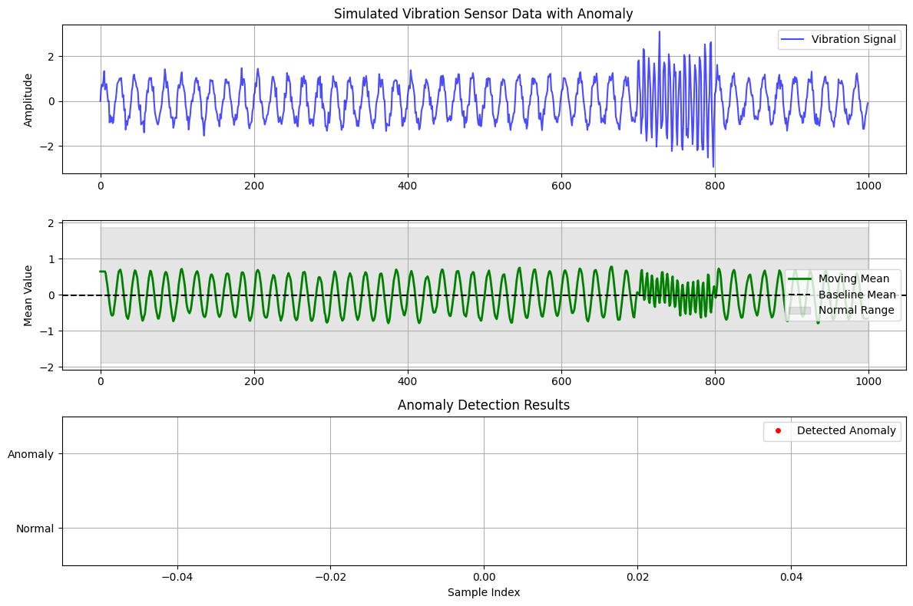

# Edge AI for Real-Time Vibration Anomaly Detection

  

## Abstract
This project implements a lightweight, real-time anomaly detection system for vibration sensor data, simulating an Arduino environment. The system is designed for predictive maintenance on industrial equipment. Using a statistical modeling approach, it establishes a baseline for normal vibration patterns and flags significant deviations indicative of potential faults. The entire pipeline—data simulation, feature extraction, model training, and real-time inference—is implemented in Python to emulate an edge computing device, demonstrating the principles of TinyML.

## Features
- **Realistic Data Simulation:** Generates time-series vibration data with configurable noise, drift, and fault patterns.
- **Lightweight Algorithm:** Utilizes a Moving Average and Standard Deviation model for efficient computation on resource-constrained devices (like Arduino).
- **Real-Time Inference:** Processes data stream-by-stream, mimicking reading from an actual sensor.
- **Comprehensive Visualization:** Includes scripts to plot the generated data and the detection results.

## Project Structure

EdgeAI-Vibration-Anomaly-Detector/
│
├── src/
│ ├── data_simulator.py # Simulates an Arduino sensor stream
│ ├── anomaly_detector.py # The core AI detection logic
│ └── visualizer.py # Creates plots and graphs
│
├── data/
│ └── training_data.csv # Saved dataset for model training (generated)
│
├── models/
│ └── baseline_params.json # Saved model parameters (generated)
│
├── requirements.txt # Python dependencies
└── README.md # This file


## Installation & Usage

1.  **Clone the repository and install dependencies:**
    ```bash
    git clone https://github.com/your-username/EdgeAI-Vibration-Anomaly-Detector.git
    cd EdgeAI-Vibration-Anomaly-Detector
    pip install -r requirements.txt
    ```

2.  **Generate training data and train the model:**
    ```bash
    python src/data_simulator.py --generate_training_data
    python src/anomaly_detector.py --train
    ```
    This creates a `training_data.csv` file and saves the model's parameters to `models/baseline_params.json`.

3.  **Run a real-time simulation:**
    ```bash
    python src/data_simulator.py
    ```
    Watch the console output! It will print `NORMAL` or `** ANOMALY DETECTED! **` for each simulated data point.

4.  **Generate visualizations:**
    ```bash
    python src/visualizer.py
    ```
    This will create plots showing the simulated data and where anomalies were detected, saved in the project directory.

## Theory and Methodology
The anomaly detector uses a moving window to calculate the short-term mean (µ) and standard deviation (σ) of the vibration signal. The baseline "normal" state is defined by a longer-term mean (µ_baseline) and standard deviation (σ_baseline) established during training.

An anomaly is triggered if the current short-term statistics deviate beyond a set threshold (k):
`|µ - µ_baseline| > k * σ_baseline` OR `|σ - σ_baseline| > k * σ_baseline`

This method is computationally cheap and effective for detecting changes in signal behavior, making it ideal for edge devices.

## Results
The simulator injects a known anomaly into the vibration signal. The plot below shows the system's performance, successfully flagging the anomalous region while maintaining a low false-positive rate during normal operation.
*(Note: The plot will be generated when you run the code)*



## Future Work
- Port the code to a real Arduino Nano 33 BLE Sense board.
- Extend the model to a micro-trained Decision Tree or Neural Network using TensorFlow Lite for Microcontrollers.
- Develop a companion mobile app for Bluetooth-based alerting.

---
**Developed by Mudit Kumar Singh (B.Tech ECE)**
